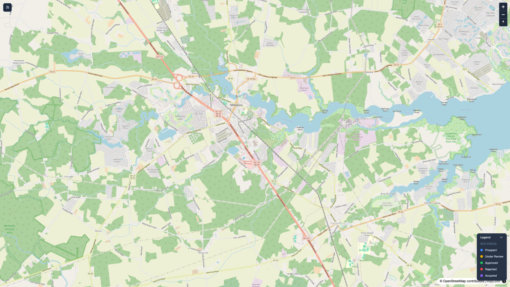

# Revised Data Center Site Pre-Feasibility Report
**Address:** 499 Mitchell St, Millsboro, DE 19966
**Coordinates:** 38.577769 N, -75.282803 W
**State:** DE | **County:** Sussex County
**Original Report Date:** 2026-04-15
**Revised:** 2026-04-20
**Target Capacity:** 500 MW

---

## Executive Summary
**Revised Overall Site Rating: 3.4 / 5.0 (Viable with Conditions)**
*Previous rating: 2.6 / 5.0 (Challenging)*

The original automated assessment undervalued this site by failing to account for its most important infrastructure asset: the **retired Indian River Power Plant** (~785 MW, NRG Energy), located approximately **0.5 miles northeast** of the subject property. Indian River's existing high-voltage switchyard, transmission interconnection, and 1,200 acres of industrially-zoned land fundamentally change the grid access calculus. Combined with regulatory research showing no competing data center projects in Sussex County and $11.6B in PJM eastern transmission investment, this site warrants serious consideration — contingent on resolution of the statewide interconnection pause and large-load tariff (PSC Docket 25-0826).

---

## Site Map

*DC Site Mapper view showing transmission lines (red), substations, and Indian River Power Plant area (northeast of town center).*

---

## What Changed: Indian River Power Plant

| Detail | Value |
|--------|-------|
| **Distance from site** | ~0.8 km / 0.5 mi (38.5852, -75.2834) |
| **Former capacity** | 785 MW (4 coal units) |
| **Status** | Fully retired Feb 2025; 16 MW oil peaker decommissioning June 2025 |
| **Owner** | NRG Energy (Indian River Power LLC) |
| **Site acreage** | ~1,200 acres |
| **Transmission** | 230 kV and 138 kV interconnection to Delmarva Power grid |
| **Competing interest** | Proposed interconnection point for US Wind offshore farm (121 turbines) |
| **Gas access** | Nearest gas transmission line ~2 mi away on US-113 (~$10M+ extension) |
| **Flood risk** | Much of the plant site is in a flood zone; highest elevation ~30 ft ASL |

### Why This Matters

The Indian River interconnection was **engineered to export ~785 MW of generation** to the PJM grid. While generation export and load import are not identical (power flow direction, protection schemes, and network topology differ), the underlying transmission corridor — switchyard, transformers, 230 kV and 138 kV lines, rights-of-way — represents substantial latent infrastructure capacity that a data center developer could leverage. PJM confirmed that transmission upgrades allowed the plant to retire ahead of schedule, so some reconfiguration has occurred, but the physical assets remain.

Key strategic considerations:
- **NRG partnership/acquisition:** NRG owns the 1,200-acre site and is evaluating next uses. A data center developer could negotiate co-location, substation access, or outright acquisition of the interconnection rights.
- **US Wind competition:** The Indian River substation is also the proposed POI for US Wind's offshore wind farm. If that project secures the interconnection, the window for a DC developer narrows — but a behind-the-meter or co-located arrangement could be complementary.
- **Brownfield advantages:** Industrial zoning already in place. Environmental remediation may be required for portions of the coal plant site but the existing infrastructure offsets this cost.

---

## 1. Power Infrastructure (Revised)

### Transmission Lines (within 30 km)
| Class | Voltage | Dist (km) | Owner | Substations |
| --- | --- | --- | --- | --- |
| 220-287 | 230 kV | 3.6 | DELMARVA POWER | Indian River area — UNKNOWN128221 to UNKNOWN128222 |
| 100-161 | 138 kV | 2.5 | DELMARVA POWER | Indian River to Wharton (UNKNOWN128223 - WHARTON) |
| UNDER 100 | 69 kV | 15.0 | DELMARVA POWER | PEPPER - TAP170955 |
| NOT AVAILABLE | NOT AVAILABLE | 1.2 | DELMARVA POWER | UNKNOWN157408 - RISER170959 |

### Nearest Substation: Indian River
- **Distance:** ~0.8 km from subject property
- **Voltage levels:** 230 kV, 138 kV
- **Former throughput:** ~785 MW (generation export)
- **Current status:** Retired plant; switchyard and transmission ties remain
- **Owner:** NRG Energy
- **138 kV corridor:** Indian River to Frankford substation (~12 mi, existing ROW)

### Grid Adequacy Assessment (Revised)
- **Estimated Capacity (automated):** 200 MW (based on line voltage only)
- **Revised Estimate:** 400-600 MW (accounting for Indian River interconnection infrastructure, subject to PJM system impact study)
- **Upgrade Required:** Yes, but significantly de-risked by existing infrastructure
- **Confidence:** Medium-High (requires PJM feasibility study to confirm)
- **Revised Score:** [++++−] (4/5)

### Planned Grid Buildout (within 150 km)
| Substation | Current | Planned Project | Target kV | Dist (km) |
| --- | --- | --- | --- | --- |
| Milford | 230 kV | Rebuild Cartanza-Milford 230 kV Line | 230 kV | 35 |
| Steele | 230 kV | Reconductor Keeney to Steele 230 kV | 230 kV | 58 |
| Cartanza | 230 kV | Rebuild Cartanza-Milford 230 kV Line | 230 kV | 71 |
| BL England | New | Ocean Wind BL England to Oyster Creek | 275 kV | 97 |
| Hope Creek | 500 kV | Upgrade Silver Run - Hope Creek 230 kV | 230 kV | 101 |

### PJM RTEP Context
- 2025 Window 1: $11.6B in projects; Delmarva zone specifically identified for needs
- Drivers: accelerated load growth + offshore wind delays in eastern PJM
- Eastern PJM solutions include 500 kV upgrades and a new 765 kV line
- 2026 RTEP baseline studies underway (March-June 2026)

---

## 2. Regulatory Landscape (New Section)

### Interconnection Pause — CRITICAL
**PSC Docket No. 25-0826** has paused all new large-load (≥25 MW) interconnections in Delmarva Power territory.
- **Filed:** September 3, 2025
- **Final tariff due:** April 27, 2026
- **Hearing examiner ruling:** Summer 2026
- **Commission decision:** Late 2026
- **Impact:** No 500 MW facility can begin interconnection proceedings until the pause lifts

### Large-Load Tariff (Pending)
- Threshold: ≥25 MW (Delmarva proposes 50 MW)
- Covers: qualification criteria, upfront financial commitments, grid upgrade cost allocation, contract terms
- Central issue: preventing cost-shifting to residential/small-business ratepayers
- Parties: Delmarva, PSC Staff, Public Advocate, DNREC, Starwood (intervenor)

### Rate Case (Concurrent)
- **Docket 25-1555:** Delmarva seeking $67.8M distribution rate increase (21.7%)
- Sets baseline rate that large-load tariff layers on top of

### IRP Gap
- Last Delmarva IRP filed November 2016 — no public load forecast accounts for ~2.5 GW DC pipeline
- No Sussex County-specific demand projections available

---

## 3. Competitive Landscape

### Delaware Data Center Pipeline (~2,455 MW total)
| Project | Location | Developer | Capacity | Status |
|---------|----------|-----------|----------|--------|
| Project Washington | Delaware City (New Castle) | Starwood Digital Ventures | 1,200 MW | CZA denied Mar 2026; appealed |
| Frightland/St. Georges | Middletown (New Castle) | Undisclosed | 600-1,000 MW | Filed with county |
| Newark | White Clay Creek (New Castle) | Shelbourne | 130-250 MW | Exploratory |
| 2 Additional | Undisclosed | Undisclosed | ~100-200 MW | "Advanced interest" |

**Sussex County: No disclosed competing projects.** This site would be the first data center entrant in the county — no interconnection queue congestion, but no existing infrastructure momentum either.

### Comparative Advantage
The New Castle County projects face their own headwinds:
- Project Washington's coastal zone permit was denied; appeal is uncertain
- New Castle County enacted new data center regulations (effective March 2026)
- All NCC projects compete for the same northern Delaware grid capacity
- Sussex County offers a **clear lane** with the Indian River interconnection as anchor infrastructure

---

## 4. Utility & Rates
- **Service territory:** Delmarva Power & Light (Exelon subsidiary)
- **Industrial rate:** Not currently published; pending rate case (Docket 25-1555)
- **Large-load tariff:** Under development (Docket 25-0826); final structure TBD by late 2026
- **DC-specific tariff:** None currently; the 25-0826 proceeding will create one

## 5. Land Use & Zoning
- **Land cover:** Developed, Medium Intensity (NLCD 23)
- **OSM zoning:** Industrial — confirmed at or near this location
- **Indian River site:** ~1,200 acres, industrially zoned, brownfield

## 6. Environmental & Regulatory Risk

### Air Quality: Attainment Zone
Standard air permitting for backup generators. No nonattainment issues.

### Flood Zone
FEMA data not available for this specific parcel. Note: the adjacent Indian River plant site has significant flood exposure (~4 events/year projected by mid-century).

### Environmental Justice: Disadvantaged Community (Justice40)
- **Census Tract:** 10005050602
- **Diesel PM Percentile:** 0.76
- **Housing Burden Percentile:** 0.74
- Additional EJ analysis and community engagement likely required. Given the area's history with the coal plant, community sentiment toward another large industrial facility may be mixed.

### Seismic: SDC A (Low)
- PGA: 0.063g — standard construction adequate

### Climate & Land Cost
- **Cooling Degree Days:** 1,117 (Moderate — favorable for cooling costs)
- **Est. Land Cost:** ~$8M for 150 acres (at 5x DE farmland average)

## 7. Infrastructure Gaps (Unchanged)
| Infrastructure | Status | Mitigation |
|---------------|--------|------------|
| Gas pipelines | None within 50 km; nearest line ~2 mi on US-113 | ~$10M+ extension; or all-electric design |
| Water | None found within 30 km | Air-cooled design; or source from Indian River (tidal) |
| Fiber/telecom | None found within 30 km | New fiber build required; nearest lit building TBD |
| Interstate access | None found within 30 km | US-113 is the primary north-south corridor |

These gaps are real but solvable costs, not fatal flaws — particularly for a 500 MW campus where infrastructure buildout is a fraction of total project cost.

---

## 8. Revised Site Suitability Score

| Factor | Original | Revised | Rationale | Weight |
|--------|----------|---------|-----------|--------|
| Grid Access | 2/5 | **4/5** | Indian River interconnection (785 MW former capacity) 0.5 mi away; 230 kV + 138 kV lines | 20% |
| Utility Rate | 3/5 | **3/5** | Unchanged; pending rate case + large-load tariff | 15% |
| Environmental | 4/5 | **3/5** | Downgraded slightly: EJ community + coal plant brownfield adjacency + flood risk | 15% |
| Fiber/Telecom | 2/5 | **2/5** | No fiber found; new build required | 10% |
| Water | 2/5 | **2/5** | No water facilities found; air-cooled or tidal source needed | 5% |
| Transportation | 2/5 | **2/5** | No interstate; US-113 is primary corridor | 5% |
| Tax Incentives | 2/5 | **2/5** | No DE-specific DC incentives identified | 15% |
| DC Tariff Risk | 3/5 | **3/5** | Large-load tariff in progress; interconnection pause is temporary but active | 15% |

**Revised Weighted Total: 3.4 / 5.0 (Viable with Conditions) — up from 2.6**

The single biggest driver of the upgrade is the Indian River interconnection, which transforms the grid access picture from "significant upgrades required" to "substantial existing infrastructure available."

---

## 9. Key Risks & Conditions

### Must-Resolve (Deal Blockers)
1. **Interconnection pause** (Docket 25-0826) — cannot proceed until tariff is finalized (late 2026)
2. **NRG/Indian River access** — must negotiate substation access, co-location, or site acquisition with NRG before US Wind or another party locks up the interconnection
3. **PJM system impact study** — must confirm that Indian River interconnection can accept 500 MW of load (vs. its former 785 MW generation export configuration)

### Should-Resolve (Manageable)
4. **Large-load tariff terms** — cost allocation methodology will determine project economics
5. **Fiber build** — no existing infrastructure; cost and timeline TBD
6. **EJ community engagement** — Justice40 designation + coal plant history require proactive outreach
7. **Flood risk assessment** — detailed FEMA/site-specific study needed

### Watch Items
8. **US Wind POI competition** — if offshore wind project secures Indian River as POI, assess co-location or alternative interconnection
9. **PJM RTEP 2026** — baseline studies underway; may identify Delmarva zone upgrades that benefit this site
10. **Project Washington appeal** — if Starwood's coastal zone appeal succeeds, political/regulatory attention may shift away from Sussex County

---

## 10. Strategic Recommendation

This site's value proposition is **proximity to the Indian River interconnection** — not the parcel itself. The recommended path:

1. **Engage NRG Energy immediately** to assess availability and terms for the Indian River substation/site. This is the time-critical step — the US Wind offshore project also has eyes on this interconnection point.
2. **Monitor Docket 25-0826** through the April 27 tariff filing and summer hearing. The tariff structure will define project economics.
3. **Initiate PJM pre-application** study for 500 MW load at or near the Indian River POI to confirm deliverability and identify any network upgrades.
4. **Evaluate the Indian River site itself** as the primary campus location (1,200 acres, industrial, existing interconnection) rather than 499 Mitchell St as a secondary option.

---

## Research Links

**Regulatory Filings (Halcyon):**
- [Delmarva Power + IRP](https://app.halcyon.io/workspaces/preview?keyword=Delmarva%20Power,integrated%20resource%20plan)
- [Delmarva Power + Data Center](https://app.halcyon.io/workspaces/preview?keyword=Delmarva%20Power,data%20center)
- [Docket 25-0826](https://app.halcyon.io/workspaces/preview?keyword=25-0826)
- [Delmarva + Transmission + Sussex](https://app.halcyon.io/workspaces/preview?keyword=Delmarva%20Power,transmission,Sussex)

**PJM:**
- [PJM RTEP 2025 Window 1](https://insidelines.pjm.com/pjm-reviews-preliminary-recommended-projects-for-2025-rtep-window-1/)
- [PJM Queue (Sussex)](https://www.google.com/search?q=%22PJM%22%20interconnection%20queue%20%22Sussex%22%20data%20center)

**Regulatory:**
- [DE PSC Large Load Tariff](https://depsc.delaware.gov/2025/10/14/delaware-psc-opens-docket-for-large-load-tariff-pauses-interconnections/)
- [DE PSC Electric Regulation](https://depsc.delaware.gov/electric-regulation/)

**Local:**
- [Sussex County Zoning / GIS](https://www.google.com/search?q=Sussex%20County%20DE%20zoning%20map%20GIS%20parcel%20viewer)
- [Indian River Plant — Spotlight Delaware](https://spotlightdelaware.org/2026/04/03/could-the-indian-river-power-plant-be-restarted/)
- [Indian River — Global Energy Monitor](https://www.gem.wiki/Indian_River_power_station)

**News / Context:**
- [DC Demand — Spotlight Delaware](https://spotlightdelaware.org/2026/01/15/data-centers-could-nearly-double-delawares-power-demand-delmarva-says/)
- [Large-Load Tariff Debate — Technical.ly](https://technical.ly/civics/delaware-large-load-tariff-data-center-costs/)
- [DE DC Projects — Sierra Club](https://www.sierraclub.org/delaware/proposed-data-center-projects)

---

## Appendix: Full Regulatory Research
See companion report: [research_delmarva_power_irp_de_regulatory.md](research_delmarva_power_irp_de_regulatory.md)

---
*Revised assessment incorporating Indian River Power Plant analysis and Delaware regulatory research. Original automated report generated by dc-site-analysis; manual overlay based on public sources, PJM RTEP materials, and DE PSC filings.*
